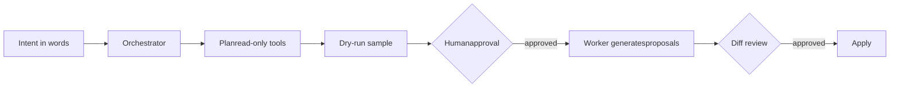

<h1 align="center">
  
</h1>

Fullstack developer based in Sochi, Russia. I build production-grade web applications, with a current focus on e-commerce platforms and their integrations.

### Focus for 2026

Developing e-commerce systems with integrations across analytics platforms and AI services.

---

### Stack

**Frontend**

**Backend & Data**

**Currently learning**

---

### GitHub

  

---

### Get in touch

